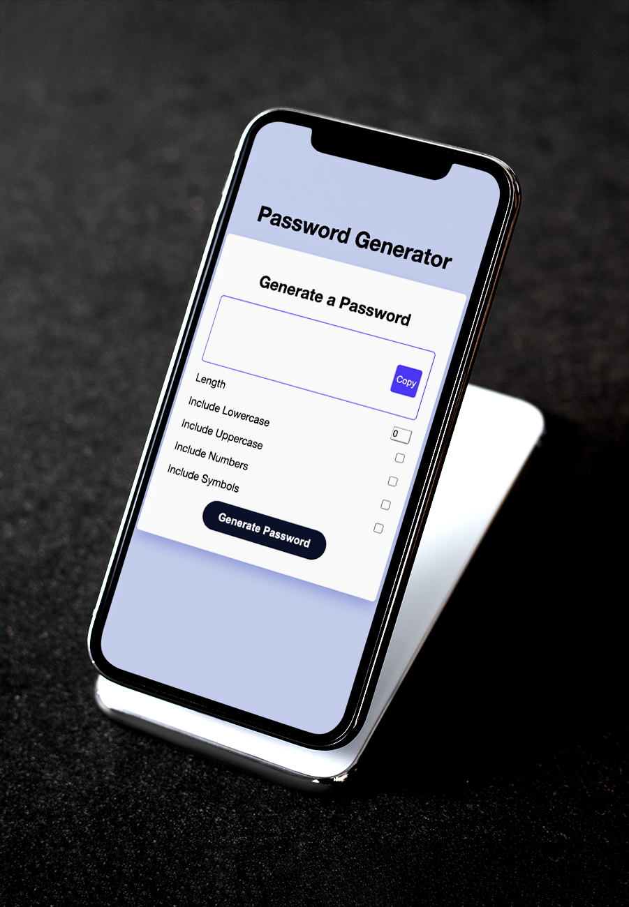

# PASSWORD GENERATOR APP
## **Deployed web address**
https://kyunginlee.github.io/03-password-generator/
 

## **Project Description**

An applet which is able to generate a password consisting of a mix of uppercase, lowercase, numbers and symbols as specified by the user. The user is also able to set the number of characters the password must meet. The generated password will be shown on screen, and a ‘copy’ button will be available for the user to copy the password and paste where they require.

 

## **Functionality / Technologies Used**

The String.fromCharCode(characterCode) generates the string via a loop taking values from the character codes defined from the ASCII table, the passwordCharacters.push() populate the characters to the array, and passwordCharacters.join(“) converts the array to a string and returns result to the user.

1) HTML / CSS / JAVASCRIPT

 

## **Installation and usage instructions**

1) Head to https://kyunginlee.github.io/03-password-generator/ and on confirming prompt to select character type, check boxes corresponding to the character types required. Specify number of characters required. 

2) Click ‘generate password’ to generate based on variables chosen and click ‘copy’ button to copy password and paste/use where required.

## **Future Development**

Toggle visibility - An eye ‘open and close’ toggle so that the user has the option to view or hide generated password in situations where privacy is limited.

Password storage - Encrypted  storage providing user the ability to save multiple passwords within app itself 

## **Resources**
1) How to Build a Random Password Generator app with HTML, CSS and JavaScript
https://www.section.io/engineering-education/how-to-build-a-random-password-generator-app-with-html-css-javascript/
